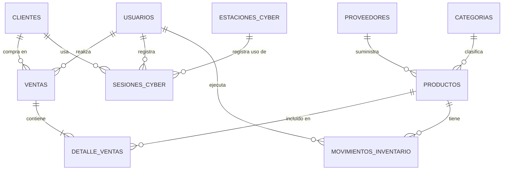

# Diseño de Base de Datos - EIS System

## Índice
1. [Introducción](#introducción)
2. [Identificación de Entidades](#identificación-de-entidades)
3. [Diagrama MER](#diagrama-mer)
4. [Definición de Tablas](#definición-de-tablas)
5. [Relaciones](#relaciones)
6. [Script SQL](#script-sql)
7. [Instrucciones de Implementación](#instrucciones-de-implementación)

---

## Introducción

Este documento detalla el diseño de la base de datos para el sistema **EIS System**, una aplicación PHP con arquitectura MVC para la gestión integral de un negocio. La base de datos se denominará `zwl` y utilizará MySQL.

### Módulos del Sistema
- Dashboard con métricas en tiempo real
- Gestión de Inventario (CRUD)
- Punto de Venta (POS)
- Control de Cybercafé
- Gestión de Proveedores
- Reportes y Estadísticas
- Gestión de Activos

---

## Identificación de Entidades

### 1. USUARIOS
Entidad responsable de almacenar los usuarios del sistema.

| Atributo | Tipo | Restricciones |
|----------|------|---------------|
| id_usuario | INT | PK, AUTO_INCREMENT |
| nombre | VARCHAR(100) | NOT NULL |
| email | VARCHAR(100) | UNIQUE, NOT NULL |
| password | VARCHAR(255) | NOT NULL |
| rol | ENUM('admin','vendedor','cajero') | DEFAULT 'vendedor' |
| fecha_creacion | TIMESTAMP | DEFAULT CURRENT_TIMESTAMP |
| estado | BOOLEAN | DEFAULT TRUE |

### 2. PROVEEDORES
Entidad para la gestión de proveedores de productos.

| Atributo | Tipo | Restricciones |
|----------|------|---------------|
| id_proveedor | INT | PK, AUTO_INCREMENT |
| nombre | VARCHAR(100) | NOT NULL |
| contacto | VARCHAR(100) | |
| telefono | VARCHAR(20) | |
| email | VARCHAR(100) | |
| direccion | TEXT | |
| fecha_registro | TIMESTAMP | DEFAULT CURRENT_TIMESTAMP |
| estado | BOOLEAN | DEFAULT TRUE |

### 3. CATEGORIAS
Entidad para clasificar los productos del inventario.

| Atributo | Tipo | Restricciones |
|----------|------|---------------|
| id_categoria | INT | PK, AUTO_INCREMENT |
| nombre | VARCHAR(50) | NOT NULL, UNIQUE |
| descripcion | TEXT | |
| estado | BOOLEAN | DEFAULT TRUE |

### 4. PRODUCTOS (INVENTARIO)
Entidad principal del inventario.

| Atributo | Tipo | Restricciones |
|----------|------|---------------|
| id_producto | INT | PK, AUTO_INCREMENT |
| codigo | VARCHAR(50) | UNIQUE, NOT NULL |
| nombre | VARCHAR(100) | NOT NULL |
| descripcion | TEXT | |
| id_categoria | INT | FK, NOT NULL |
| id_proveedor | INT | FK |
| precio_compra | DECIMAL(10,2) | NOT NULL, DEFAULT 0 |
| precio_venta | DECIMAL(10,2) | NOT NULL, DEFAULT 0 |
| stock | INT | DEFAULT 0 |
| stock_minimo | INT | DEFAULT 5 |
| fecha_vencimiento | DATE | |
| fecha_registro | TIMESTAMP | DEFAULT CURRENT_TIMESTAMP |
| estado | BOOLEAN | DEFAULT TRUE |

### 5. CLIENTES
Entidad para registrar clientes en el punto de venta.

| Atributo | Tipo | Restricciones |
|----------|------|---------------|
| id_cliente | INT | PK, AUTO_INCREMENT |
| nombre | VARCHAR(100) | NOT NULL |
| documento | VARCHAR(20) | UNIQUE |
| telefono | VARCHAR(20) | |
| email | VARCHAR(100) | |
| direccion | TEXT | |
| fecha_registro | TIMESTAMP | DEFAULT CURRENT_TIMESTAMP |
| estado | BOOLEAN | DEFAULT TRUE |

### 6. VENTAS
Entidad cabecera para las transacciones de ventas.

| Atributo | Tipo | Restricciones |
|----------|------|---------------|
| id_venta | INT | PK, AUTO_INCREMENT |
| numero_venta | VARCHAR(20) | UNIQUE, NOT NULL |
| id_cliente | INT | FK |
| id_usuario | INT | FK, NOT NULL |
| fecha_venta | TIMESTAMP | DEFAULT CURRENT_TIMESTAMP |
| subtotal | DECIMAL(10,2) | NOT NULL, DEFAULT 0 |
| impuesto | DECIMAL(10,2) | DEFAULT 0 |
| descuento | DECIMAL(10,2) | DEFAULT 0 |
| total | DECIMAL(10,2) | NOT NULL, DEFAULT 0 |
| metodo_pago | ENUM('efectivo','tarjeta','transferencia','mixto') | DEFAULT 'efectivo' |
| estado | ENUM('pendiente','completada','anulada') | DEFAULT 'completada' |

### 7. DETALLE_VENTAS
Entidad para el detalle de productos vendidos.

| Atributo | Tipo | Restricciones |
|----------|------|---------------|
| id_detalle | INT | PK, AUTO_INCREMENT |
| id_venta | INT | FK, NOT NULL |
| id_producto | INT | FK, NOT NULL |
| cantidad | INT | NOT NULL, DEFAULT 1 |
| precio_unitario | DECIMAL(10,2) | NOT NULL |
| subtotal | DECIMAL(10,2) | NOT NULL |

### 8. ESTACIONES_CYBER
Entidad para el control de estaciones del cybercafé.

| Atributo | Tipo | Restricciones |
|----------|------|---------------|
| id_estacion | INT | PK, AUTO_INCREMENT |
| numero | INT | UNIQUE, NOT NULL |
| nombre | VARCHAR(50) | |
| estado | ENUM('disponible','ocupada','mantenimiento') | DEFAULT 'disponible' |
| tarifa_hora | DECIMAL(10,2) | DEFAULT 0 |
| fecha_registro | TIMESTAMP | DEFAULT CURRENT_TIMESTAMP |

### 9. SESIONES_CYBER
Entidad para registrar el uso de estaciones.

| Atributo | Tipo | Restricciones |
|----------|------|---------------|
| id_sesion | INT | PK, AUTO_INCREMENT |
| id_estacion | INT | FK, NOT NULL |
| id_cliente | INT | FK |
| id_usuario | INT | FK, NOT NULL |
| hora_inicio | DATETIME | NOT NULL |
| hora_fin | DATETIME | |
| minutos_uso | INT | DEFAULT 0 |
| monto_cobrado | DECIMAL(10,2) | DEFAULT 0 |
| estado | ENUM('activa','finalizada','anulada') | DEFAULT 'activa' |

### 10. ACTIVOS
Entidad para la gestión de activos fijos del negocio.

| Atributo | Tipo | Restricciones |
|----------|------|---------------|
| id_activo | INT | PK, AUTO_INCREMENT |
| codigo | VARCHAR(50) | UNIQUE, NOT NULL |
| nombre | VARCHAR(100) | NOT NULL |
| descripcion | TEXT | |
| tipo | VARCHAR(50) | |
| valor_compra | DECIMAL(10,2) | DEFAULT 0 |
| fecha_adquisicion | DATE | |
| estado | ENUM('activo','en_mantenimiento','dado_baja') | DEFAULT 'activo' |
| fecha_registro | TIMESTAMP | DEFAULT CURRENT_TIMESTAMP |

### 11. MOVIMIENTOS_INVENTARIO
Entidad para tracking de entradas y salidas de inventario.

| Atributo | Tipo | Restricciones |
|----------|------|---------------|
| id_movimiento | INT | PK, AUTO_INCREMENT |
| id_producto | INT | FK, NOT NULL |
| tipo | ENUM('entrada','salida','ajuste') | NOT NULL |
| cantidad | INT | NOT NULL |
| motivo | VARCHAR(100) | |
| id_usuario | INT | FK, NOT NULL |
| fecha_movimiento | TIMESTAMP | DEFAULT CURRENT_TIMESTAMP |

---

## Diagrama MER

### Representación Textual del MER

```
+---------------+           +------------------+           +---------------+
|  PROVEEDORES  |----------<|     PRODUCTOS    |>----------|  CATEGORIAS   |
+---------------+           +------------------+           +---------------+
| PK id_proveedor|           | PK id_producto   |           | PK id_categoria|
|    nombre     |           | FK id_categoria  |           |    nombre     |
|    contacto   |           | FK id_proveedor  |           | descripcion   |
|    telefono   |           |    codigo        |           |    estado     |
|    email      |           |    nombre        |           +---------------+
|    direccion  |           |    descripcion   |
+---------------+           |    precio_compra |
                             |    precio_venta  |
+------------------+        |    stock         |
|     USUARIOS     |        |    stock_minimo  |
+------------------+        +------------------+
| PK id_usuario    |               |
|    nombre        |               |
|    email         |               |
|    password      |               |
|    rol           |               |
+------------------+               |
         |                         |
         |                         |
         v                         v
+------------------+        +------------------+
|      VENTAS      |--------|  DETALLE_VENTAS |
+------------------+        +------------------+
| PK id_venta      |        | PK id_detalle    |
| FK id_cliente    |        | FK id_venta      |
| FK id_usuario    |        | FK id_producto   |
|    numero_venta  |        |    cantidad      |
|    fecha_venta   |        |    precio_unitario|
|    subtotal      |        |    subtotal      |
|    impuesto      |        +------------------+
|    descuento     |
|    total         |
|    metodo_pago   |
|    estado       |
+------------------+
         |
         v
+------------------+
|    CLIENTES      |
+------------------+
| PK id_cliente    |
|    nombre       |
|    documento    |
|    telefono    |
|    email       |
|    direccion   |
+------------------+

+------------------+        +------------------+
| ESTACIONES_CYBER |--------| SESIONES_CYBER   |
+------------------+        +------------------+
| PK id_estacion   |        | PK id_sesion     |
|    numero       |        | FK id_estacion   |
|    nombre       |        | FK id_cliente    |
|    estado       |        | FK id_usuario    |
|    tarifa_hora  |        |    hora_inicio   |
+------------------+        |    hora_fin      |
                            |    minutos_uso   |
+------------------+        |    monto_cobrado |
|     ACTIVOS      |        |    estado        |
+------------------+        +------------------+
| PK id_activo     |
|    codigo        |
|    nombre        |
|    descripcion   |
|    tipo          |
|    valor_compra  |
|    fecha_adquisicion|
|    estado        |
+------------------+

+------------------------+
| MOVIMIENTOS_INVENTARIO |
+------------------------+
| PK id_movimiento       |
| FK id_producto         |
|    tipo                |
|    cantidad            |
|    motivo              |
| FK id_usuario          |
|    fecha_movimiento    |
+------------------------+
```

### Diagrama Mermaid (para herramientas como Mermaid Live Editor)



---

## Relaciones

### Cardinalidad de las Relaciones

| Relación | Cardinalidad | Descripción |
|----------|--------------|-------------|
| USUARIOS - VENTAS | 1:N | Un usuario puede realizar muchas ventas |
| USUARIOS - SESIONES_CYBER | 1:N | Un usuario registra muchas sesiones cyber |
| USUARIOS - MOVIMIENTOS_INVENTARIO | 1:N | Un usuario ejecuta muchos movimientos |
| CLIENTES - VENTAS | 1:N | Un cliente puede tener muchas ventas |
| CLIENTES - SESIONES_CYBER | 1:N | Un cliente puede usar muchas estaciones |
| PROVEEDORES - PRODUCTOS | 1:N | Un proveedor suministra muchos productos |
| CATEGORIAS - PRODUCTOS | 1:N | Una categoría clasifica muchos productos |
| PRODUCTOS - DETALLE_VENTAS | 1:N | Un producto puede estar en muchos detalles |
| PRODUCTOS - MOVIMIENTOS_INVENTARIO | 1:N | Un producto tiene muchos movimientos |
| VENTAS - DETALLE_VENTAS | 1:N | Una venta tiene muchos detalles |
| ESTACIONES_CYBER - SESIONES_CYBER | 1:N | Una estación registra muchas sesiones |

---

## Script SQL

### Creación de la Base de Datos

```sql
-- Crear la base de datos
CREATE DATABASE IF NOT EXISTS zwl CHARACTER SET utf8mb4 COLLATE utf8mb4_unicode_ci;
USE zwl;
```

### Creación de Tablas

```sql
-- Tabla: usuarios
CREATE TABLE usuarios (
    id_usuario INT PRIMARY KEY AUTO_INCREMENT,
    nombre VARCHAR(100) NOT NULL,
    email VARCHAR(100) NOT NULL UNIQUE,
    password VARCHAR(255) NOT NULL,
    rol ENUM('admin', 'vendedor', 'cajero') DEFAULT 'vendedor',
    fecha_creacion TIMESTAMP DEFAULT CURRENT_TIMESTAMP,
    estado BOOLEAN DEFAULT TRUE
) ENGINE=InnoDB;

-- Tabla: categorias
CREATE TABLE categorias (
    id_categoria INT PRIMARY KEY AUTO_INCREMENT,
    nombre VARCHAR(50) NOT NULL UNIQUE,
    descripcion TEXT,
    estado BOOLEAN DEFAULT TRUE
) ENGINE=InnoDB;

-- Tabla: proveedores
CREATE TABLE proveedores (
    id_proveedor INT PRIMARY KEY AUTO_INCREMENT,
    nombre VARCHAR(100) NOT NULL,
    contacto VARCHAR(100),
    telefono VARCHAR(20),
    email VARCHAR(100),
    direccion TEXT,
    fecha_registro TIMESTAMP DEFAULT CURRENT_TIMESTAMP,
    estado BOOLEAN DEFAULT TRUE
) ENGINE=InnoDB;

-- Tabla: productos (inventario)
CREATE TABLE productos (
    id_producto INT PRIMARY KEY AUTO_INCREMENT,
    codigo VARCHAR(50) NOT NULL UNIQUE,
    nombre VARCHAR(100) NOT NULL,
    descripcion TEXT,
    id_categoria INT NOT NULL,
    id_proveedor INT,
    precio_compra DECIMAL(10,2) NOT NULL DEFAULT 0,
    precio_venta DECIMAL(10,2) NOT NULL DEFAULT 0,
    stock INT DEFAULT 0,
    stock_minimo INT DEFAULT 5,
    fecha_vencimiento DATE,
    fecha_registro TIMESTAMP DEFAULT CURRENT_TIMESTAMP,
    estado BOOLEAN DEFAULT TRUE,
    FOREIGN KEY (id_categoria) REFERENCES categorias(id_categoria),
    FOREIGN KEY (id_proveedor) REFERENCES proveedores(id_proveedor)
) ENGINE=InnoDB;

-- Tabla: clientes
CREATE TABLE clientes (
    id_cliente INT PRIMARY KEY AUTO_INCREMENT,
    nombre VARCHAR(100) NOT NULL,
    documento VARCHAR(20) UNIQUE,
    telefono VARCHAR(20),
    email VARCHAR(100),
    direccion TEXT,
    fecha_registro TIMESTAMP DEFAULT CURRENT_TIMESTAMP,
    estado BOOLEAN DEFAULT TRUE
) ENGINE=InnoDB;

-- Tabla: ventas
CREATE TABLE ventas (
    id_venta INT PRIMARY KEY AUTO_INCREMENT,
    numero_venta VARCHAR(20) NOT NULL UNIQUE,
    id_cliente INT,
    id_usuario INT NOT NULL,
    fecha_venta TIMESTAMP DEFAULT CURRENT_TIMESTAMP,
    subtotal DECIMAL(10,2) NOT NULL DEFAULT 0,
    impuesto DECIMAL(10,2) DEFAULT 0,
    descuento DECIMAL(10,2) DEFAULT 0,
    total DECIMAL(10,2) NOT NULL DEFAULT 0,
    metodo_pago ENUM('efectivo', 'tarjeta', 'transferencia', 'mixto') DEFAULT 'efectivo',
    estado ENUM('pendiente', 'completada', 'anulada') DEFAULT 'completada',
    FOREIGN KEY (id_cliente) REFERENCES clientes(id_cliente),
    FOREIGN KEY (id_usuario) REFERENCES usuarios(id_usuario)
) ENGINE=InnoDB;

-- Tabla: detalle_ventas
CREATE TABLE detalle_ventas (
    id_detalle INT PRIMARY KEY AUTO_INCREMENT,
    id_venta INT NOT NULL,
    id_producto INT NOT NULL,
    cantidad INT NOT NULL DEFAULT 1,
    precio_unitario DECIMAL(10,2) NOT NULL,
    subtotal DECIMAL(10,2) NOT NULL,
    FOREIGN KEY (id_venta) REFERENCES ventas(id_venta) ON DELETE CASCADE,
    FOREIGN KEY (id_producto) REFERENCES productos(id_producto)
) ENGINE=InnoDB;

-- Tabla: estaciones_cyber
CREATE TABLE estaciones_cyber (
    id_estacion INT PRIMARY KEY AUTO_INCREMENT,
    numero INT NOT NULL UNIQUE,
    nombre VARCHAR(50),
    estado ENUM('disponible', 'ocupada', 'mantenimiento') DEFAULT 'disponible',
    tarifa_hora DECIMAL(10,2) DEFAULT 0,
    fecha_registro TIMESTAMP DEFAULT CURRENT_TIMESTAMP
) ENGINE=InnoDB;

-- Tabla: sesiones_cyber
CREATE TABLE sesiones_cyber (
    id_sesion INT PRIMARY KEY AUTO_INCREMENT,
    id_estacion INT NOT NULL,
    id_cliente INT,
    id_usuario INT NOT NULL,
    hora_inicio DATETIME NOT NULL,
    hora_fin DATETIME,
    minutos_uso INT DEFAULT 0,
    monto_cobrado DECIMAL(10,2) DEFAULT 0,
    estado ENUM('activa', 'finalizada', 'anulada') DEFAULT 'activa',
    FOREIGN KEY (id_estacion) REFERENCES estaciones_cyber(id_estacion),
    FOREIGN KEY (id_cliente) REFERENCES clientes(id_cliente),
    FOREIGN KEY (id_usuario) REFERENCES usuarios(id_usuario)
) ENGINE=InnoDB;

-- Tabla: activos
CREATE TABLE activos (
    id_activo INT PRIMARY KEY AUTO_INCREMENT,
    codigo VARCHAR(50) NOT NULL UNIQUE,
    nombre VARCHAR(100) NOT NULL,
    descripcion TEXT,
    tipo VARCHAR(50),
    valor_compra DECIMAL(10,2) DEFAULT 0,
    fecha_adquisicion DATE,
    estado ENUM('activo', 'en_mantenimiento', 'dado_baja') DEFAULT 'activo',
    fecha_registro TIMESTAMP DEFAULT CURRENT_TIMESTAMP
) ENGINE=InnoDB;

-- Tabla: movimientos_inventario
CREATE TABLE movimientos_inventario (
    id_movimiento INT PRIMARY KEY AUTO_INCREMENT,
    id_producto INT NOT NULL,
    tipo ENUM('entrada', 'salida', 'ajuste') NOT NULL,
    cantidad INT NOT NULL,
    motivo VARCHAR(100),
    id_usuario INT NOT NULL,
    fecha_movimiento TIMESTAMP DEFAULT CURRENT_TIMESTAMP,
    FOREIGN KEY (id_producto) REFERENCES productos(id_producto),
    FOREIGN KEY (id_usuario) REFERENCES usuarios(id_usuario)
) ENGINE=InnoDB;
```

### Índices para Optimización

```sql
-- Índices adicionales para mejorar rendimiento
CREATE INDEX idx_productos_codigo ON productos(codigo);
CREATE INDEX idx_productos_nombre ON productos(nombre);
CREATE INDEX idx_ventas_fecha ON ventas(fecha_venta);
CREATE INDEX idx_ventas_numero ON ventas(numero_venta);
CREATE INDEX idx_detalle_ventas_venta ON detalle_ventas(id_venta);
CREATE INDEX idx_sesiones_estacion ON sesiones_cyber(id_estacion);
CREATE INDEX idx_sesiones_fecha ON sesiones_cyber(hora_inicio);
CREATE INDEX idx_movimientos_producto ON movimientos_inventario(id_producto);
CREATE INDEX idx_movimientos_fecha ON movimientos_inventario(fecha_movimiento);
```

### Datos Iniciales (Opcional)

```sql
-- Insertar usuario administrador por defecto
-- Password: admin123 (debe ser hasheado con password_hash en PHP)
INSERT INTO usuarios (nombre, email, password, rol) VALUES
('Administrador', 'admin@eis.com', '$2y$10$hash_generado_por_password_hash', 'admin');

-- Insertar categorías básicas
INSERT INTO categorias (nombre, descripcion) VALUES
('General', 'Categoría general'),
('Bebidas', 'Bebidas y refrescos'),
('Snacks', 'Snacks y comida rápida'),
('Tecnología', 'Productos tecnológicos'),
('Servicios', 'Servicios ofrecidos');

-- Insertar estaciones de cyber por defecto
INSERT INTO estaciones_cyber (numero, nombre, tarifa_hora) VALUES
(1, 'PC-01', 2.50),
(2, 'PC-02', 2.50),
(3, 'PC-03', 2.50),
(4, 'PC-04', 2.50),
(5, 'PC-05', 2.50);
```

---

## Instrucciones de Implementación

### Paso 1: Preparar el Entorno
1. Asegurarse de tener MySQL instalado (versión 5.7+)
2. Iniciar el servidor MySQL (XAMPP/WAMP/LAMP)
3. Verificar credenciales en `src/Config/database.php`

### Paso 2: Crear la Base de Datos
```bash
# Desde la línea de comandos de MySQL
mysql -u root -p
```

Luego ejecutar el script de creación de base de datos y tablas.

### Paso 3: Importar el Script SQL
1. Copiar todo el contenido de la sección [Script SQL](#script-sql)
2. Pegar en phpMyAdmin o ejecutar desde la consola MySQL
3. Verificar que no haya errores

### Paso 4: Verificar la Estructura
```sql
-- Verificar tablas creadas
SHOW TABLES;

-- Verificar estructura de una tabla
DESCRIBE productos;
```

### Paso 5: Actualizar la Configuración de Conexión
Verificar que `src/Config/database.php` tenga los datos correctos:
```php
$host = "localhost";
$db = "zwl";
$user = "root";
$pass = "";
```

### Paso 6: Probar la Conexión
Crear un archivo de prueba temporal:
```php
<?php
require_once 'src/Config/database.php';
if ($pdo) {
    echo "Conexión exitosa a la base de datos zwl";
}
?>
```

### Paso 7: Actualizar el Modelo CRUD
Modificar `src/app/Models/crud.php` para incluir las nuevas tablas y funciones necesarias para cada módulo.

---

## Notas Adicionales

### Consideraciones de Seguridad
- Las contraseñas deben almacenarse usando `password_hash()` de PHP
- Usar siempre prepared statements (ya configurado en PDO)
- Validar y sanitizar todas las entradas de usuario

### Convenciones de Nomenclatura
- Tablas: minúsculas, plural (ej: `productos`, `ventas`)
- Campos: minúsculas, singular (ej: `nombre`, `fecha_creacion`)
- Claves primarias: `id_` + nombre singular (ej: `id_producto`)
- Claves foráneas: `id_` + tabla referenciada (ej: `id_categoria`)

### Mantenimiento
- Hacer backups regulares de la base de datos
- Monitorear el crecimiento de las tablas `ventas` y `movimientos_inventario`
- Considerar particionamiento si la tabla `ventas` crece mucho

---

*Documento generado para el proyecto EIS System - Proyecto a mano*
